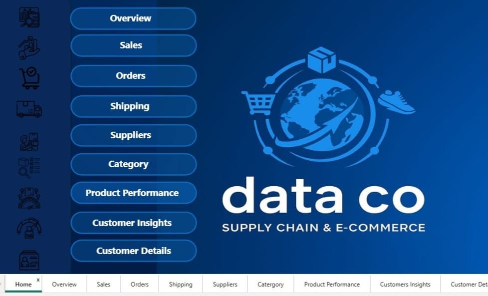
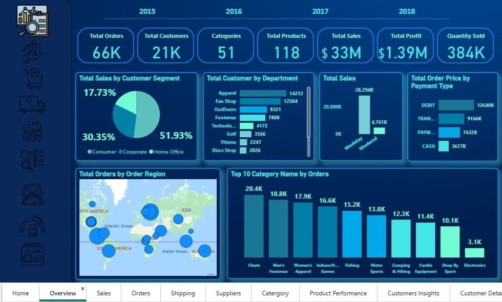
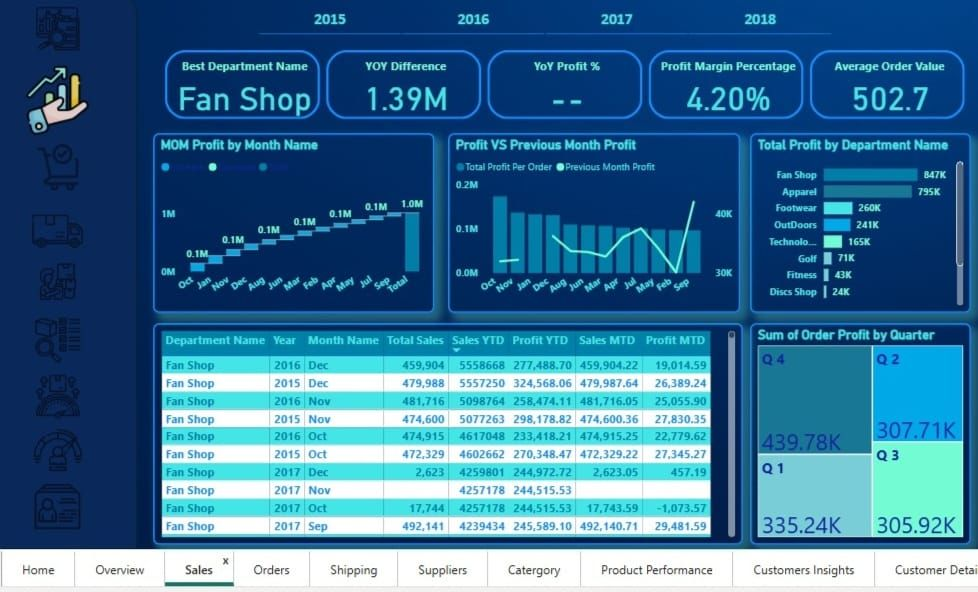
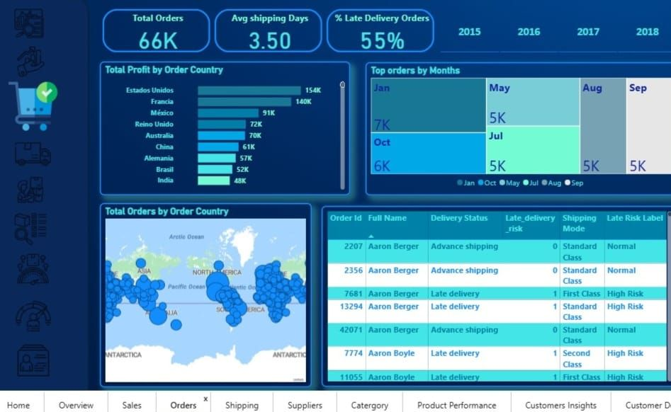
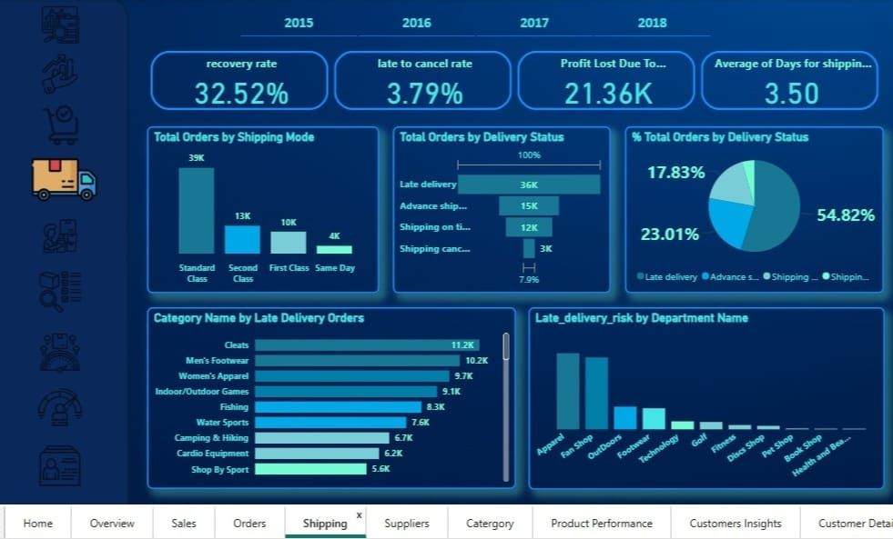
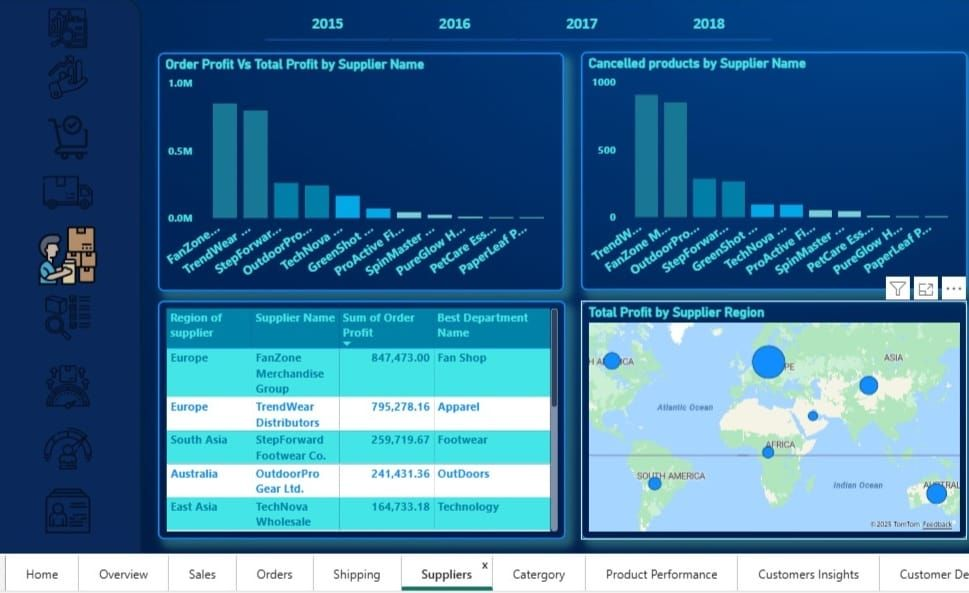
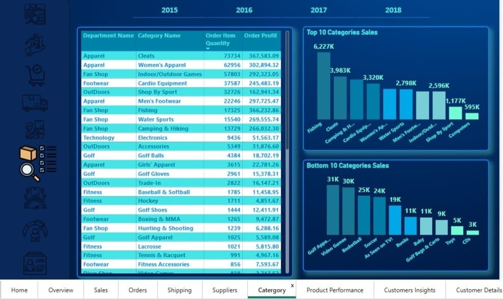
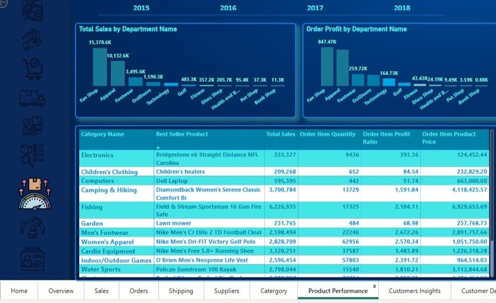
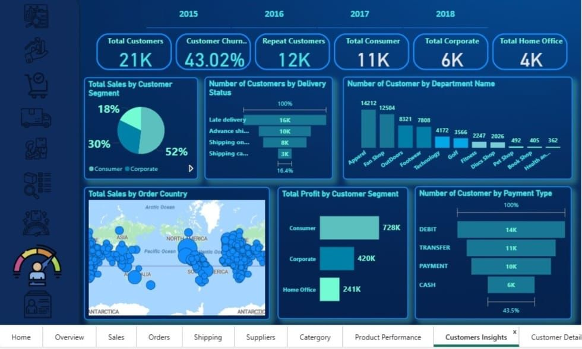
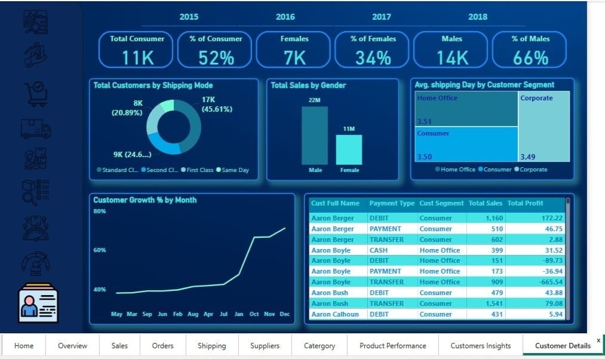

# 📊 DataCo Supply Chain Analysis Dashboard — Power BI Project

## 🧠 Project Overview

This project presents an **interactive Power BI dashboard** built using the **DataCo Global Supply Chain dataset**. The dashboard provides comprehensive insights into sales performance, orders, shipping efficiency, supplier performance, product categories, and customer behavior to support data-driven business decisions.

---

## 🗂️ Data Modeling

A structured data model was created to establish relationships between fact and dimension tables, including:

* Customer
* Order
* OrderItem
* Product
* Category
* Suppliers
* Date
* Depatment
* Transactions

These relationships enable efficient analysis and accurate calculations across multiple business areas.

---

## ⚙️ DAX Measures

Several custom DAX measures were created to calculate important KPIs, including:

* Total Sales
* Total Profit
* Total Orders
* Average Shipping Days
* Late Delivery Percentage
* Recovery Rate
* Customer Growth %
* Year-over-Year (YoY) Difference
* Month-over-Month (MoM) Profit
* Profit Lost Due to Late Delivery

These measures enable dynamic analysis and interactive filtering.

---

## 📈 Dashboard Pages & Visuals

### **Overview Dashboard**

* KPIs for Sales, Profit, Orders, Customers, Products, and Categories
* Sales by Customer Segment
* Top Categories by Orders
* Sales by Payment Type
* Orders Distribution by Region

### **Sales Dashboard**

* Monthly Profit Trends
* Profit by Department
* YoY Difference
* Quarter-wise Profit Analysis

### **Orders Dashboard**

* Total Orders and Average Shipping Days
* Late Delivery Orders Percentage
* Orders by Country
* Monthly Order Trends

### **Shipping Dashboard**

* Orders by Shipping Mode
* Delivery Status Analysis
* Late Delivery Categories
* Profit Loss Due to Delayed Deliveries

### **Suppliers Dashboard**

* Supplier Profitability Analysis
* Cancelled Products by Supplier
* Profit Distribution by Supplier Region

### **Categories Dashboard**

* Top 10 Categories by Sales
* Bottom 10 Categories by Sales
* Order Quantity and Profit by Category

### **Customer Dashboard**

* Customer Demographics
* Sales by Gender
* Customer Growth Trend
* Shipping Preferences
* Customer Segmentation Analysis

---

## 💡 Key Insights

* Fan Shop and Apparel are among the most profitable departments.
* Standard Class is the most frequently used shipping mode.
* Late deliveries significantly impact profitability.
* Consumer customers contribute the largest share of sales and profit.
* Sports-related categories generate the highest revenue.
* Europe and North America are the leading regions in supplier profitability.

---

## 🧰 Tools & Technologies

* **Power BI Desktop**
* **DAX (Data Analysis Expressions)**
* **Power Query**
* **Data Modeling**
* **Data Visualization**

---

## 🚀 How to Use

1. Download the `.pbix` file from this repository.
2. Open the file using **Power BI Desktop**.
3. Explore the dashboards interactively using filters and slicers.

---

## 📷 Dashboard Preview

### Home Dashboard

### Overview Dashboard

### Sales Dashboard

### Orders Dashboard

### Shipping Dashboard

### Suppliers Dashboard

### Categories Dashboard

### Product_Performance Dashboard

### Customers Insights Dashboard

### Customers Details Dashboard

---

## 🏁 Conclusion

This project demonstrates how Power BI, data modeling, and DAX can transform supply chain data into meaningful insights, helping businesses improve operational efficiency, customer satisfaction, and profitability.

---

## 👩‍💻 Author

**Nourhan Rabea**

💼 Aspiring Data Analyst | Power BI Developer

🔗 LinkedIn: https://www.linkedin.com/in/nourhan-rabea
